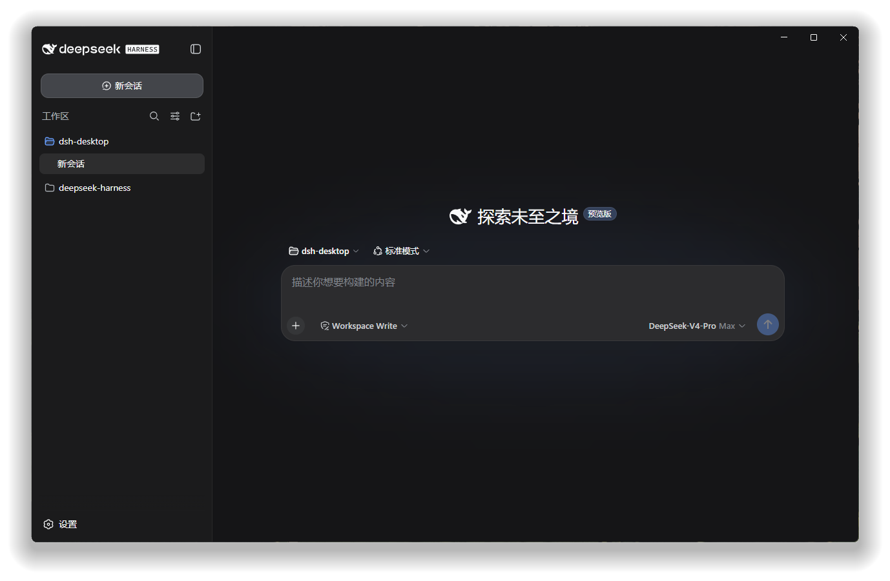

# DeepSeek Harness Desktop

[简体中文](./README.md) | English

[](https://www.npmjs.com/package/@anestis271/dsh-desktop)
[](https://www.npmjs.com/package/@anestis271/dsh-desktop)
[](./LICENSE)


Turn the official DeepSeek Harness WebUI into a natural desktop experience.

This is not a separate client and does not require a standalone desktop installer. It is a lightweight dsh plugin that keeps every capability of the official WebUI and adds a clean, native desktop shell around it.

## Preview



## Why This Plugin

- **No separate app installer**: no additional MSI, DMG, or AppImage; install one npm plugin and start dsh.
- **The official WebUI stays the single source of truth**: no copied, forked, or reimplemented interface.
- **Clean by design**: no second business state, account system, or background service.
- **A native desktop feel**: system tray, native window controls, a coordinated title bar, and optional shortcuts.
- **Fast repeated launches**: clicking a shortcut again activates the existing window instead of creating another dsh and WebUI instance.

## Install

Make sure dsh already runs on your machine, then use:

```bash
dsh plugin --profile desktop add @anestis271/dsh-desktop
dsh --profile desktop
```

That is all. The first launch automatically prepares the desktop runtime for the current platform, and later launches reuse it without extra setup.

## Desktop Experience

- Close the window to the system tray
- Show or hide the window, reload the WebUI, open the profile directory, or quit from the tray
- Follow dsh's Chinese or English language setting in real time
- Keep native minimize, maximize, and close controls on every platform
- Match the title bar with the WebUI sidebar for a continuous L-shaped visual
- Keep exactly one window and one tray instance for each profile
- Create user-level shortcuts on Windows, macOS, and Linux

## Shortcuts

Desktop icons, application-menu entries, and launch-at-login are disabled by default. After starting dsh Desktop, enable only the entries you need under **Settings → General settings → Desktop shortcuts** in the official WebUI.

Every entry still launches only `dsh --profile desktop`. It does not install another application or require administrator access. Disabling an option removes only the entry created by this plugin.

## Design Principle

`dsh-desktop` does only what a desktop shell should do. Sessions, settings, models, tools, and every product interface continue to come from the official DeepSeek Harness WebUI, without creating a parallel client that must be maintained separately.

## License

[MIT](./LICENSE)
